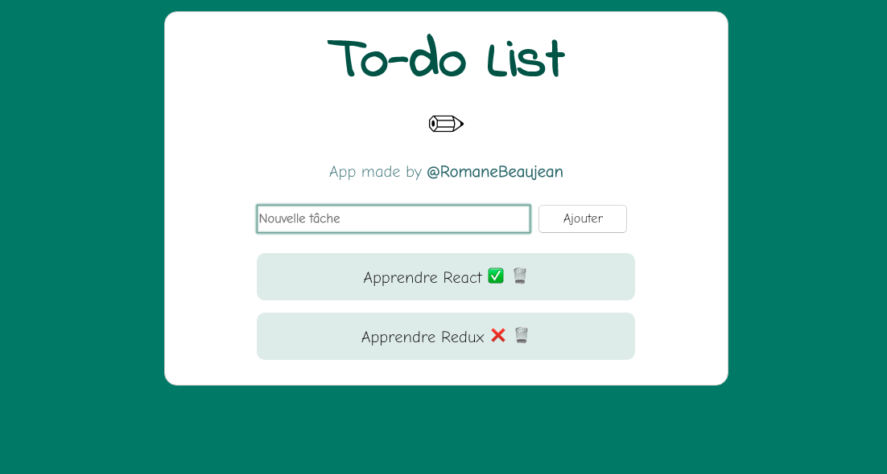
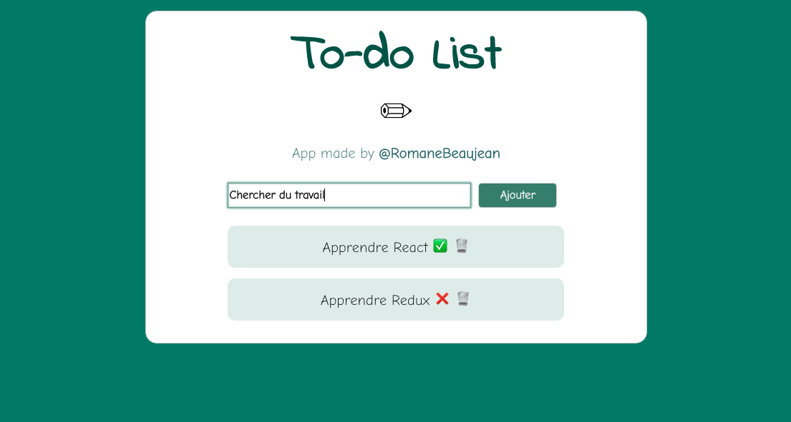
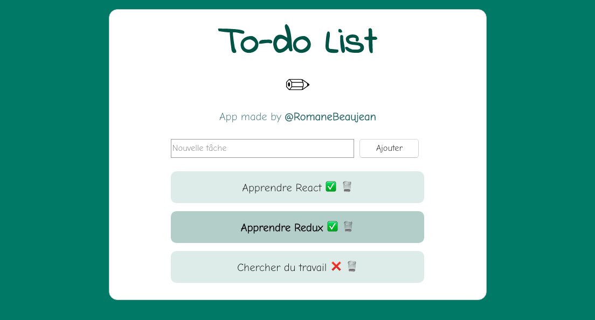

# todolist-react
First project with react: create a dynamic to-do-list

First, enter en new task and click on "Ajouter"

Then, you can click on the cross to indicate that you have done this task. You can also click on the dash to delete the task.

